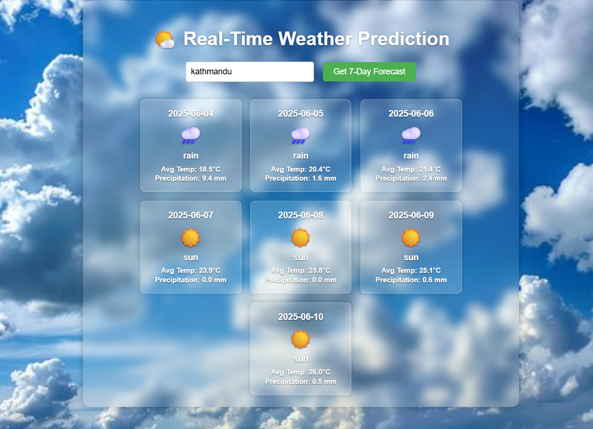

# 🌦️ Weather Forecast

A real-time weather forecasting application powered by LSTM (Long Short-Term Memory) deep learning architecture. The system fetches live weather data via API and uses machine learning to predict future weather conditions with high accuracy. The project includes a comparative study between LSTM and LSTM-CNN hybrid models, with LSTM achieving superior performance.




## 🚀 Features

• LSTM Neural Network - Selected for superior accuracy in weather prediction after comparative analysis

• Model Comparison Study - Evaluated both LSTM and LSTM-CNN hybrid architectures

• Real-Time Weather Data - Integrates with weather APIs to fetch current conditions and forecasts

• Pre-trained Model - Trained LSTM model ready for instant predictions

• Smart Preprocessing - Automated feature scaling and normalization

• Interactive Web Interface - User-friendly input forms and result visualization

• Flask REST API - Backend server that loads the ML model and handles prediction requests

• Visual Analytics - Clear charts and displays for weather predictions

## 🧱 Built With

**Backend:** Flask (Python), TensorFlow/Keras

**Frontend:** HTML, CSS, JavaScript

**Machine Learning:** LSTM Neural Network (with LSTM-CNN comparative study)

**Data Processing:** Scikit-learn, NumPy, Pandas

**Weather API:** OpenWeatherMap / WeatherAPI (specify your API)

**Model Format:** Keras (.keras)

## 📊 Model Architecture

**LSTM Model (Primary):**
- Captures temporal dependencies in weather sequences
- Remembers long-term weather patterns
- Handles time-series data effectively
- **Chosen for final predictions due to higher accuracy**

**LSTM-CNN Hybrid (Comparative Study):**
- Combines CNN for spatial feature extraction with LSTM for temporal patterns
- Tested for performance comparison
- Helps identify optimal architecture for weather forecasting

**Model Selection:**
After comparing both architectures, the **LSTM model demonstrated superior accuracy** and was selected as the primary prediction model. The hybrid model was explored as part of the research to evaluate different deep learning approaches for weather forecasting.

## 🌐 API Integration

The application fetches real-time weather data including:
- Current temperature, humidity, and pressure
- Wind speed and direction
- Cloud cover and visibility
- Historical weather data for prediction

## ⚙️ Installation

### 1. Clone the Repository
```bash
git clone https://github.com/Sadikshya-dhakal/Weather-Forecast.git
cd Weather-Forecast
```

### 2. Create a Virtual Environment
```bash
python -m venv venv
```

**For Linux/macOS:**
```bash
source venv/bin/activate
```

**For Windows:**
```bash
venv\Scripts\activate
```

### 3. Install Dependencies
```bash
pip install flask tensorflow numpy pandas scikit-learn flask-cors requests
```

### 4. Configure API Key
Create a `.env` file in the backend folder:
```bash
WEATHER_API_KEY=your_api_key_here
```

### 5. Run the Flask Application
```bash
cd backend
python app.py
```

Then open your browser and visit:
👉 **http://127.0.0.1:5000/**

## 📄 Project Report

📊 [View Full Project Report](https://drive.google.com/file/d/1We1Otqo6OV3S3jz5xi4EYKihECyRR4P3/view?usp=drive_link)

Comprehensive documentation including:
- Model architecture and training methodology
- Performance metrics and accuracy analysis
- Dataset description and preprocessing steps
- Comparative study with baseline models
- Results and visualizations

## 💻 Usage

### Making Predictions via API
```python
import requests

# Send POST request with weather parameters
response = requests.post('http://127.0.0.1:5000/predict', 
    json={
        'temperature': 25.5,
        'humidity': 60,
        'pressure': 1013,
        # ... other parameters
    }
)

prediction = response.json()
print(prediction)
```

### Loading the Model Manually
```python
from tensorflow.keras.models import load_model
import pickle

# Load the trained model
model = load_model('lstm_model.keras')

# Load the scaler
with open('scaler.pkl', 'rb') as f:
    scaler = pickle.load(f)

# Make prediction
scaled_data = scaler.transform(input_data)
prediction = model.predict(scaled_data)
```

## 🔮 Future Enhancements

• Multi-day forecasting (7-day, 14-day predictions)

• Location-based weather predictions using coordinates

• Mobile application (Android/iOS)

• Interactive weather maps and visualizations

• Weather alerts and notifications

• Model retraining with updated data

## 🤝 Contributing

Contributions are welcome! Please feel free to submit a Pull Request.

1. Fork the repository
2. Create your feature branch (`git checkout -b feature/AmazingFeature`)
3. Commit your changes (`git commit -m 'Add some AmazingFeature'`)
4. Push to the branch (`git push origin feature/AmazingFeature`)
5. Open a Pull Request

## 📄 License

This project is open source and available under the [MIT License](LICENSE).

## 📧 Contact

For questions or feedback, please open an issue on GitHub.

---

⭐ If you found this project helpful, please consider giving it a star!
